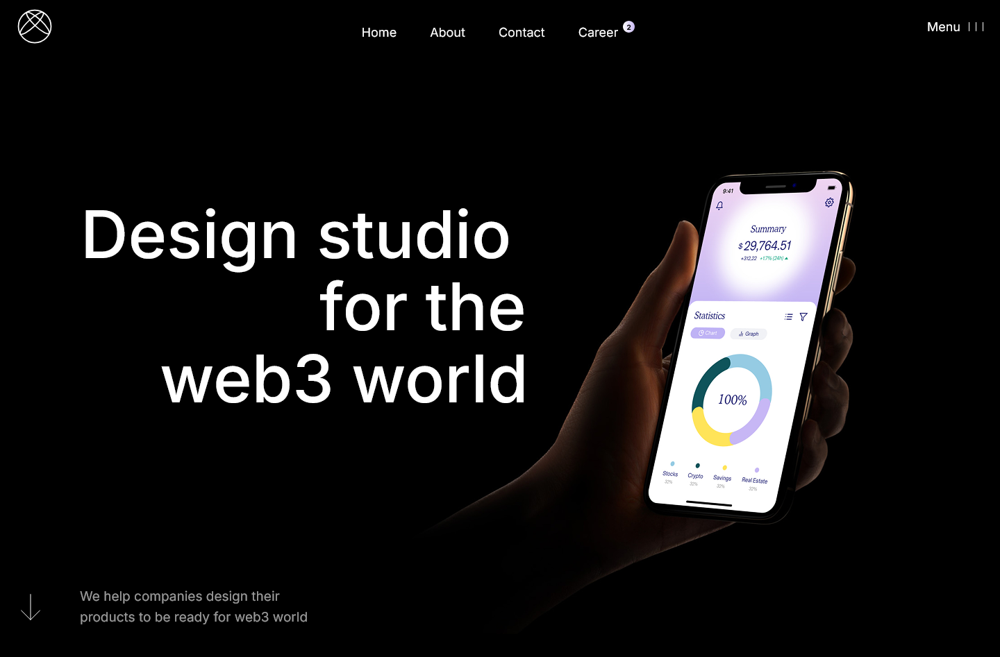

# Web3 Design Studio

Landing page created as a web design practice project. Based on a Figma design of a fictional web3-focused design studio.

**Live demo:** https://denyshum.github.io/web-practice

---

## Screenshot



---

## Tech stack

- HTML5
- CSS3
- JavaScript (Vanilla)
- [Swiper.js](https://swiperjs.com/) — slider library

---

## Features

- **Menu overlay** — full-screen navigation overlay with smooth open/close animation and button icon swap
- **Projects slider** — Swiper.js powered slider with loop, autoplay, custom indicators and prev/next controls
- **Scrolled header** — header background changes on scroll
- **Scroll down hint** — hides automatically when the backers section enters the viewport (IntersectionObserver)
- **Back to top** — smooth scroll to top with custom ease-in-out animation via `requestAnimationFrame`
- **Parallax effect** — team photos in the About section move at different speeds on scroll
- **Services tabs** — animated tab switcher with fade transition and click-lock to prevent animation overlap
- **Responsive design** — mobile-first layout with breakpoints at 481px, 769px, 1025px, 1201px, 1441px

---

## Project structure

```
./
├── assets/
│   ├── css/
│   │   ├── _variables.css
│   │   └── style.css
│   ├── images/
│   │   ├── backers/
│   │   ├── icons/
│   │   ├── projects/
│   │   └── team/
│   └── js/
│       └── script.js
├── index.html
└── README.md
```

---

## Running locally

No build tools required. Just open `index.html` in a browser, or use any static server:

```bash
npx serve .
```